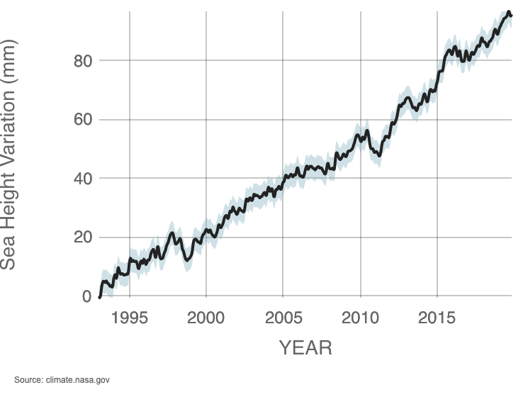

**THE EVIDENCE**

The Earth's climate has changed throughout our history. This isn't our first and (hopefully) isn't our last. 

In the past half a million years there have been several cycles of massive climate changes that have brought about mass extinctions. The last ice age which was about 12000 years ago almost brought across the end of humanity itself. Most of these changes are attributed to very small variations in Earth's orbit that change the amount of solar energy that our planet receives.

> We are the first generation to be able to **end poverty**, and the last generation that can take steps to avoid the worst impacts of climate change. Future generations will judge us harshly if we fail to uphold our moral and historical responsibilities. 
**Ban Ki-moon, Secretary-General, United Nations**

### If we have so many climate cycles that almost ended humanity as we know it then why is this one of such significance?

### Why don't we just write this off as another natural cycle and continue to live our lives the way we have?

I'm glad you asked.

The current trend is of greater significance because this one is most likely **(> 95%)** chance that it is due to human activity since the dawn of the 20th century.

Since we started measuring climate change as a metric, we have been proceeding at an unprecedented rate over millenia.

[Ice cores]((https://www.bas.ac.uk/data/our-data/publication/ice-cores-and-climate-change/)) drawn from deep inside the planet in Greenland, Antarctica show that the Earth's climate responds to changes in greenhouse gas levels.

Below I'm going to give an unoppinionated and unbiased compelling evidence for climate change based on data and facts. At the end of the article, I will cite all my data sources so that I can be fact checked.

## The evidence for rapid climate change:

1. (Shrinking Ice Sheets)[https://nsidc.org/cryosphere/quickfacts/icesheets.html]: The Greenland and Antartic ice sheets have largely decreased in mass. Data from NASA's Gravity Recovery and Climate Experiments show that Greenland has lost an average of 300 billion tons of ice between '93 and '2016 while antarctica has lost about 150 billion tons of ice. The rate of mass loss is 3x to the time in decades.

You can also check out [Nasa Ice Viewer](https://climate.nasa.gov/interactives/global-ice-viewer/#/) to check it out yourself.

2. (Global sea levels)[] rose about 8 inches the last century alone? Does that sound less? Then think about this: in 1700's, 1800's the rising sea was 4%. Therefore there must be some variable 'x' which has caused the sea levels to double and keep accelarating.

## Conclusion

You made it! That was the entire game client of an .io game distilled to its essentials.

In [Part 2](/blog/build-an-io-game-part-2/) of this series, we'll switch to the backend and talk about to build an .io game server.

Have questions? Leave a comment below or [tweet at me](https://twitter.com/victorczhou). Found a bug or spot a problem in my code? Submit an issue or PR to the [example-.io-game Github repo](https://github.com/vzhou842/example-.io-game).

Thanks for reading!
